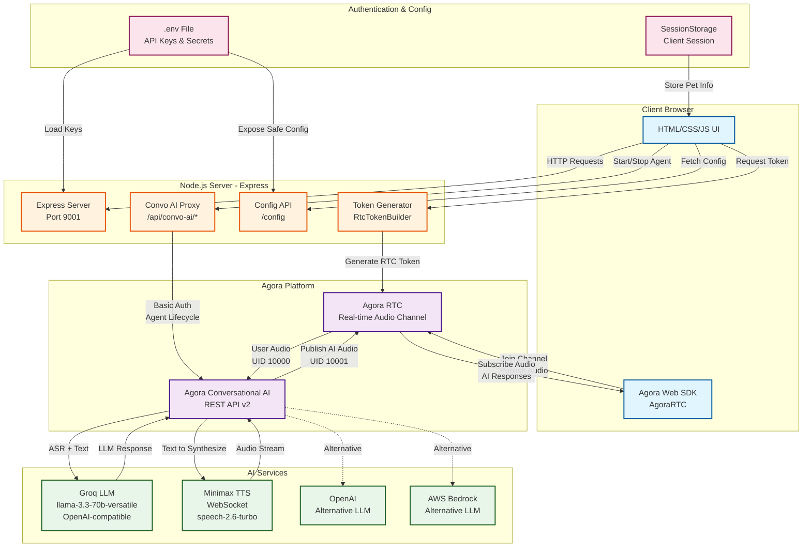
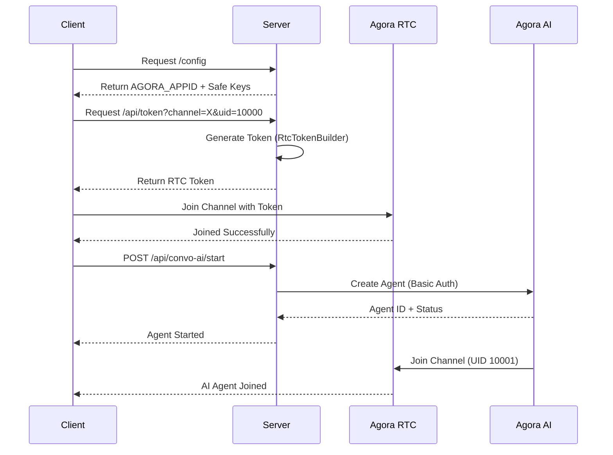
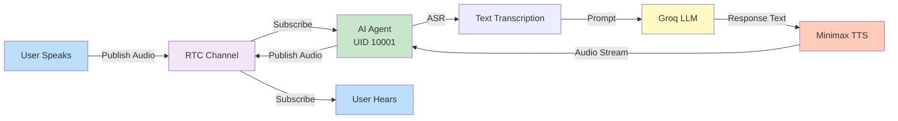

# VetAI Triage System Architecture

## System Architecture Diagram

## Component Details

### Client Layer
- **UI**: HTML/CSS/JS interface (vanilla JS + Bootstrap)
- **Agora Web SDK**: Real-time audio publishing and subscription

### Server Layer (Express)
- **Config API**: Exposes safe client configuration
- **Token Generator**: Creates Agora RTC tokens using `agora-token` library
- **Convo AI Proxy**: Proxies requests to Agora Conversational AI API
  - `/api/convo-ai/start` - Start AI agent
  - `/api/convo-ai/agents/:id/leave` - Stop agent
  - `/api/convo-ai/agents/:id/status` - Check agent status
  - `/api/convo-ai/webhook` - Receive AI events

### Agora Platform
- **RTC**: Real-time audio channel for user ↔ AI communication
- **Conversational AI**: Orchestrates ASR → LLM → TTS pipeline

### AI Services
- **Groq LLM**: Primary reasoning engine (llama-3.3-70b-versatile)
- **Minimax TTS**: Voice synthesis via WebSocket
- **OpenAI / Bedrock**: Alternative LLM options

## Authentication Flow

## Data Flow: User → AI → User

## Key Environment Variables

- `AGORA_APPID` - Agora project app ID
- `AGORA_APPCERTIFICATE` - For token generation
- `AGORA_REST_KEY` / `AGORA_REST_SECRET` - Conversational AI API auth
- `GROQ_KEY` - Groq LLM API key
- `TTS_MINIMAX_KEY` / `TTS_MINIMAX_GROUPID` - Minimax TTS credentials
- `OPENAI_KEY` - Alternative LLM (optional)
- `AVATAR_AKOOL_KEY` - Avatar service (optional)

## Tech Stack Summary

| Layer | Technology |
|-------|-----------|
| Runtime | Node.js |
| Server | Express |
| Client | Vanilla JS + Bootstrap |
| RTC SDK | Agora Web SDK v4.x |
| AI Orchestration | Agora Conversational AI REST v2 |
| LLM | Groq (llama-3.3-70b) |
| TTS | Minimax (speech-2.6-turbo) |
| Auth | Agora Token + Basic Auth |
| Config | dotenv (.env) |
